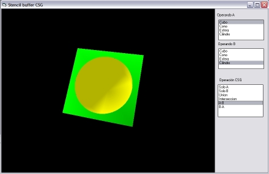



## Stencil CSG with OpenGL

### Description

Doing constructive solid geometry (CSG) with stencil buffer in opengl
 
### More Info
 
Selectable options with ListBoxes

See file Description.txt includes in the zip file

Union,Intersection and substraction of solid geometry

             |
---                |---
**Submitted On**   |2010-02-25 03:28:38
**By**             |[Ñoño Moreno Tiscar](https://github.com/Planet-Source-Code/PSCIndex/blob/master/ByAuthor/o-o-moreno-tiscar.md)
**Level**          |Advanced
**User Rating**    |5.0 (10 globes from 2 users)
**Compatibility**  |VB 6\.0
**Category**       |[Graphics](https://github.com/Planet-Source-Code/PSCIndex/blob/master/ByCategory/graphics__1-46.md)
**World**          |[Visual Basic](https://github.com/Planet-Source-Code/PSCIndex/blob/master/ByWorld/visual-basic.md)
**Archive File**   |[Stencil\_CS2175592252010\.zip](https://github.com/Planet-Source-Code/o-o-moreno-tiscar-stencil-csg-with-opengl__1-72940/archive/master.zip)

### API Declarations

See file Description.txt includes in the zip file

